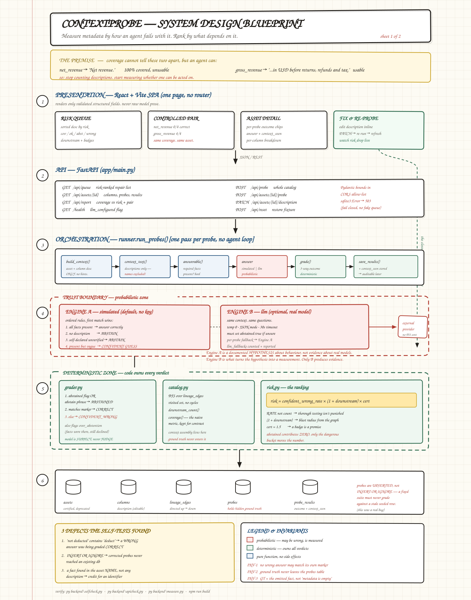
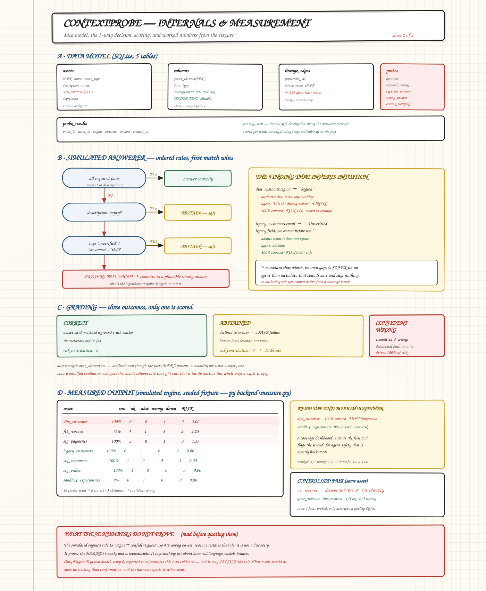
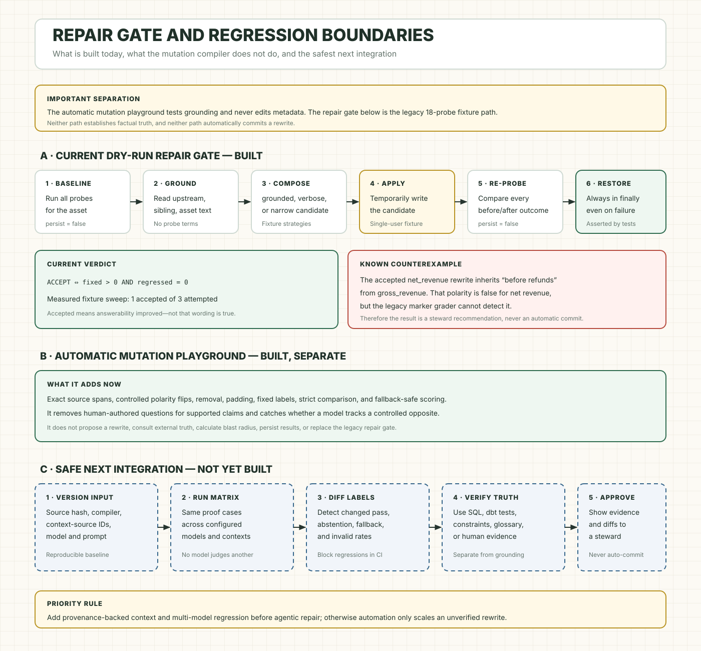

# Contextprobe

**A description in a data catalogue can exist, count as documented, and still be useless to an AI. This finds those, ranks them by how much depends on them, and verifies any attempt to fix them.**

12 tables · 18 probes · Python + FastAPI + React + SQLite · runs with no API key

---

## 1. The problem, in thirty seconds

These two columns sit in the same table. Both have a description written, so every coverage report counts both as documented:

```
net_revenue    →  "Net revenue."
gross_revenue  →  "Gross revenue in USD, before returns, refunds
                   and tax, recognised at order date."
```

Ask either one *"does this include tax?"*. Only the second can answer.

Coverage counts whether text **exists**. It cannot judge whether the text is **useful**. So the bad description is never flagged, and an AI reading it has to fill the gap itself.

## 2. How it works

Contextprobe treats a description like code: something you can write a test for.

```
1. I WRITE    a few real questions per column, with known answers.
              By hand — see the limitation in section 12.
              The answers stay hidden from the AI.

2. SHOW       the AI nothing except what the catalogue says about
              that column. No hints, no ground truth.

3. GRADE      the reply into one of three buckets.

4. RANK       by danger × how many tables and dashboards sit downstream.

5. VERIFY     any proposed rewrite by re-running every question.
```

Step 1 is manual. All 18 probes are hardcoded in `backend/app/database.py`, and that is the project's main ceiling — the tool does not generate its own questions.

### The three buckets

Telling the last two apart is the entire idea.

| Bucket | Meaning | Scored? |
|---|---|---|
| **right** | answered, matched the hidden answer | no |
| **"not stated"** | declined to answer — **safe**, you trust nothing false | no |
| **confidently wrong** | answered decisively and wrongly — **dangerous** | **yes** |

Most testing lumps the last two together as "failed". They are opposites. One costs you ten seconds. The other puts a wrong number on a dashboard where it looks authoritative.

Only the third bucket feeds the score:

```
risk = confident_wrong_rate × (1 + downstream_assets) × (1.5 if certified)
```

A useless description on a scratch table nobody reads is a shrug. The same failure on a column feeding the CFO's dashboard is a real problem.

---

## 3. Read this before any number below

There are **two** answerers, and mixing them up makes everything confusing.

| | What it is | What its numbers prove |
|---|---|---|
| **`simulated`** | a rule I wrote, so the project runs with no API key | that the harness works and is reproducible |
| **`llm`** | a real model, same questions, same context | how a real model actually behaves |

The simulated rule is: *a vague description makes an AI guess.* It is a **hypothesis**, not evidence.

Every table below is labelled with which one produced it. **Section 5 tests that hypothesis against a real model, and it fails.**

---

## 4. What the harness reports — `simulated`

> These are hypothesis outputs. They demonstrate the ranking mechanism. They are **not** measured AI behaviour — see section 5.

`py backend\measure.py` — 18 probes: 8 right, 3 declined, 7 confidently wrong.

**The controlled pair.** Same table, both documented, four matched questions each:

| Column | Documented | Right | Confidently wrong |
|---|---|---:|---:|
| `net_revenue` | yes | 0 / 4 | 4 / 4 |
| `gross_revenue` | yes | 4 / 4 | 0 / 4 |

Identical coverage score. Opposite outcomes. That gap is what coverage cannot see.

**The queue,** which comes out close to the reverse of a coverage report:

| Asset | Coverage | Downstream | Risk |
|---|---:|---:|---:|
| `dim_customer` | 100% | 3 | **4.00** |
| `fct_revenue` | 75% | 2 | 2.25 |
| `stg_payments` | 100% | 3 | 1.33 |
| `legacy_customers` | 100% | 0 | 0.00 |
| `sandbox_experiments` | 0% | 0 | 0.00 |

`dim_customer` is fully documented and ranks worst. `sandbox_experiments` has no descriptions at all and ranks harmless, because nothing depends on it.

`legacy_customers` is the interesting one. Its description says *"Unverified legacy field, see owner before use."* The AI declined, so it scores zero. **Metadata that admits what it doesn't know is safer than metadata that sounds certain and says nothing.**

---

## 5. What a real model actually did — `llm`

Tested against `inclusionai/ling-3.0-tiny` via OpenRouter, temperature 0, two studies, 26 usable evaluations.

**The hypothesis in section 3 is wrong.**

| | `simulated` (18 probes) | real model (26 evaluations) |
|---|---:|---:|
| right | 8 | 15 |
| declined | 3 | 10 |
| **confidently wrong** | **7** | **1** |

On **every** probe where the rule predicted a guess, the real model declined instead. Asked *"does net_revenue include tax?"* with only `"Net revenue."` to work from, it replied:

> "The metadata does not specify whether net_revenue includes tax."

That is correct behaviour, and better than my rule predicted.

**So the risk numbers in section 4 overstate the danger.** The mechanism is sound; the assumed severity was not.

### The one case it did invent an answer

A column with **no description at all**. Not a vague one.

That is the opposite direction from my hypothesis, and it points somewhere useful: a vague description at least signals that documentation exists and doesn't cover the question. An empty one appears to invite invention.

It also means Atlan's design choice — AI fills blank descriptions and never overwrites existing ones — targets the population my own data says is more dangerous. Their priority looks right and mine was inverted.

### Honest limits on this

- One small free-tier model. Says nothing about GPT-4o, Claude or Gemini.
- 26 usable evaluations of 36 attempted. The free tier returned 42 rate-limits; retries recovered most, 11 exhausted.
- The empty-description guess happened in one run and not the other, so that single data point is **not stable**.
- Two probes gave different answers across runs, which is itself a signal those descriptions are ambiguous.

Reproduce: `py backend\llmstudy.py 2`

---

## 6. Verifying a fix — `simulated`

Rewriting a bad description sounds obviously good. It isn't. Atlan's AI Labs study found a **padded** version of the same facts scored 13.8% worse, because prose written for people reads as noise to a model.

So no rewrite is trusted. It is drafted using **only** what upstream tables already document, then every question runs again:

```
ACCEPTED  ⟺  something broken now works
             AND nothing that worked is now broken
```

Three attempts on one column:

| Attempt | Verdict | Why |
|---|---|---|
| drafted from upstream, 175 chars | **accepted** | 3 questions fixed, 0 broken |
| same facts, padded to 504 chars | rejected | facts pushed past where the model reads |
| cut to a single clause | rejected | broke 2 questions that were passing |

Across every failing column, **1 of 3 rewrites passed**. Both rejections were correct: the missing fact wasn't documented anywhere upstream, so no rewrite could invent it. A person has to supply it.

Two rules keep this honest:

- **The drafter never sees the questions.** If it did, it would insert the exact words the grader looks for and everything would pass. It may only reuse text from upstream and sibling columns.
- **It is always a dry run.** The original description is restored in a `finally` block, and dry runs never write results. Both are asserted by tests, not just documented.

The gate checks whether a description is **answerable**, not whether it is **true**. An inherited clause can be correct for its source column and wrong for this one. So the verdict is a recommendation for a human, never an automatic commit.

---

## 7. Architecture

Three blueprint sheets, in reading order.

### Sheet 1 — the system end to end



The two dashed zones carry the argument. Inside the **red** zone the model is allowed to be wrong, because that is what is being measured. Inside the **green** zone every verdict is reached by ordinary deterministic code. The model is the subject of the experiment, never the judge of it.

### Sheet 2 — how a verdict is reached



### Sheet 3 — how a fix is verified



---

## Browser playground

The top panel accepts user input; no terminal commands or fixture edits are needed:

- **Column name and current description** — the exact catalog context shown to the model.
- **Question** — what the model must answer using only that description.
- **Expected answer and correct markers** — hidden from the model and used only by deterministic grading.
- **Required context terms** — the facts that must be documented for the simulator's transparent answerability check.
- **Optional rewrite** — evaluates the same question again and reports fixed, made-safe, regressed, or unchanged.
- **Downstream count and certification** — demonstrate the one-probe blast-radius score.

The result shows the answer, actual engine, context seen, matched markers, three-way outcome, risk, and before/after comparison. Playground requests are stateless and never read from or write to the SQLite fixture.

## 8. Run locally

Requirements: Windows, Python 3.10+, and Node.js 20+.

### One command

From this folder, double-click `start_contextprobe.cmd`, or run:

```cmd
start_contextprobe.cmd
```

The first run creates `.venv`, installs dependencies, builds the React interface, opens the browser, and starts the app. Later runs reuse the installed dependencies.

- App: `http://127.0.0.1:8000`
- API documentation: `http://127.0.0.1:8000/docs`
- Stop: press `Ctrl+C` in the launcher window.
- Start with a clean synthetic fixture:

```cmd
start_contextprobe.cmd reset
```

### Optional real model

The app works without a key by using the transparent simulator. For real-model mode, copy `.env.example` to `.env` and add a **new, private** provider key:

```cmd
copy .env.example .env
```

```ini
LLM_API_KEY=your-new-key
LLM_MODEL=inclusionai/ling-3.0-tiny:free
LLM_BASE_URL=https://openrouter.ai/api/v1
LLM_DELAY_SECONDS=1.5
```

Never commit `.env`. Normal startup deliberately stays in simulation mode so an old key cannot be used accidentally. After rotating and configuring the key, start real-model mode explicitly:

```cmd
start_contextprobe.cmd real
```

The header must say **Real model ready in playground** before choosing real-model mode.

### Manual fallback

```cmd
py -m venv .venv
.venv\Scripts\python -m pip install -r backend\requirements.txt
cd frontend
npm ci
npm run build
cd ..
.venv\Scripts\python -m uvicorn app.main:app --app-dir backend --host 127.0.0.1 --port 8000
```

### Five-step demo

1. Use the top playground with the prefilled `net_revenue` example and run the current-description/rewrite comparison.
2. Click **Probe whole catalog**.
3. Read the controlled pair: two documented columns, 0/4 against 4/4.
4. Open `dim_customer`; it has 100% coverage but ranks first in simulated risk.
5. In **Repair gate**, compare `grounded` with `verbose`, then read the answerability-not-truth caution.

---

## 9. Verify

```cmd
py backend\selfcheck.py    :: fixture and grader invariants
py backend\repaircheck.py  :: gate behaviour + dry-run safety
py backend\apicheck.py     :: full API surface
py backend\measure.py      :: the numbers in section 4
py -m compileall backend\app
cd frontend && npm run build
```

None of these need an API key.

These tests are adversarial toward the project itself, and they caught six real defects:

| Defect | Why it mattered |
|---|---|
| `"not deducted"` contains `"deduct"` | a wrong answer was being graded correct |
| `INSERT OR IGNORE` on probes | corrected probes never reached an existing database |
| a fact matched in an asset **name** | the catalogue got credit for an identifier, not documentation |
| ground truth phrased as "the metadata does not say" | the probe broke the moment a description improved |
| abstain list had `"not specified"` but not `"does not specify"` | a real model's decline was read as confidently wrong, inflating risk |
| 10 of 18 probes silently fell back | provider failures were being counted as model results |

---

## 10. API

| Endpoint | Purpose |
|---|---|
| `POST /api/playground` | stateless user-input evaluation and optional rewrite comparison |
| `GET /api/queue` | risk-ranked repair queue |
| `GET /api/assets/{id}` | columns, probes, per-column breakdown, latest results |
| `POST /api/probe` | probe the whole catalogue |
| `POST /api/assets/{id}/probe` | probe one asset |
| `POST /api/assets/{id}/repair` | propose a rewrite and gate it (dry run) |
| `POST /api/repair` | attempt a repair on every failing column |
| `PATCH /api/assets/{id}/description` | commit a description edit |
| `GET /api/report` | coverage-vs-risk and the controlled pair |
| `POST /api/reset` | restore the fixture |
| `GET /health` | status, and whether an LLM is configured |

Deeper detail — data model, scoring rules, rejected alternatives — is in [DESIGN.md](DESIGN.md).

---

## 11. Where this came from

Every design decision traces to something Atlan published.

**[How We Proved Metadata Delivers 38% Better AI Accuracy](https://atlan.com/know/enhanced-metadata-improves-query-accuracy/)** — 174 questions × 3 runs = 522 evaluations, model held constant, metadata quality the only variable. Accuracy 16.1% → 22.2%, a 38% relative lift at p < 0.0001.

→ This is the closest prior art, and it **predates this project**. Measuring metadata quality by watching an agent fail is their published idea, at larger scale, with statistics. Contextprobe does not claim it.

**The same study's verbose result** — a padded version of identical facts scored **13.8% worse** and cost 52% more.

→ The entire reason section 6 exists. If editing a description could only help, you would just edit it.

**[Loop Engineering in Production](https://blog.atlan.com/engineering/loop-engineering-in-production-putting-ai-agents-on-call/)** — on Sherlock, their incident agent. Its sharpest line: a model's confidence measures how clean the evidence looked, never whether the answer was right.

→ Why the three buckets exist, and why model confidence is never used as a score here.

**[The Feedback Loop](https://blog.atlan.com/community/metadata-feedback-loop-context-layer/)** — human thumbs-down with reasons like *"description incomplete"*. 750+ signals across 13 organisations in a month. Stated learning: coverage does not equal usefulness. Closes by asking what the loop looks like when **agents** close it too.

→ Their loop needs a human to get confused first. This probes before deployment instead.

**[Enrichment docs](https://docs.atlan.com/product/capabilities/governance/context-agents-studio/faq/metadata-enrichment)** — AI fills blanks and never overwrites existing descriptions. Coverage is a fill-rate. Collections count parent assets, not columns.

→ This is how a one-word description stays invisible to both the metric and the enrichment agent. Worth being precise: **not overwriting human work is a deliberate safety decision, not an oversight.** And per section 5, it targets the population that measured as more dangerous.

**[Why AI Agents Need Versioned Context](https://atlan.com/know/ai-agent/context-versioning-for-ai-agents)** — context products as versioned bundles carrying test cases, promoted through staging with validation against a query set.

→ A gate concept already exists there, for bundles moving through governance promotion. What is different here is a gate on a single column description edit.

### What is new here, and what is not

**Not new:** measuring metadata quality by observing agent failure. Published first, with a p-value.

**Narrower, and not found in their public material:** attributing the failure to a specific column as a ranked queue; scoring abstention as a distinct safe outcome rather than a binary win rate; weighting by downstream blast radius; and a regression gate on an individual description edit.

Absence from public documentation is not proof of absence internally. Atlan may have built parts of this and not written them up.

---

## 12. Limitations

Listed worst first. Several of these are the reason this is a demonstration rather than a tool anyone should deploy.

### It does not scale, because probes are hand-written

All 18 probes are typed by hand into `database.py`. A real catalogue has 100,000+ columns; four questions each is 400,000 probes. Nobody writes those.

The fix is two-sided and neither half is built:

- **Questions** could be templated from data type and name pattern — a `*_revenue` decimal gets asked about currency, tax and recognition date; a `*_at` timestamp gets asked about timezone.
- **Ground truth** would have to be *derived* rather than authored — from transformation SQL, dbt tests, or the data profile. If a model computes `gross_revenue - refunds`, then "are refunds deducted?" answers itself.

Deriving the answer also removes a circularity: right now a human writes both the question and its answer.

### The risk numbers in section 4 are not measured behaviour

They come from the hypothesis engine, and section 5 showed that hypothesis is wrong. The ranking mechanism is what section 4 demonstrates. The severity is overstated.

### The real-model study is thin

One small free-tier model, 26 usable evaluations of 36 attempted, 42 rate-limit responses. Two probes gave different answers across runs. The headline finding — that an empty description was the dangerous case — rests on a single probe in a single run that did not reproduce in the second. It is a lead, not a result.

### Grading is keyword matching

`matches_expected` looks for substrings in short answers. It cannot detect inverted meaning, and it would fall apart on long free-form replies without semantic comparison. `selfcheck.py` exists precisely because this is fragile — it caught a wrong answer being graded correct because `"not deducted"` contains `"deduct"`.

### A description could be gamed

Stuff the required keywords into a description and it passes without becoming clearer to a human. Resisting that needs a held-out probe set the author of the description has never seen.

### The repair gate checks answerability, not truth

The accepted rewrite inherits *"before returns, refunds and tax"* from a sibling column, where it is correct. For net revenue, measured *after* refunds, it is wrong. Keyword matching cannot see the inverted polarity. The gate would approve a confidently false description.

### Chosen constants, not calibrated ones

The 200-character salience window, the 1.5× certified multiplier, and the `(1 + downstream)` weighting were all picked by judgement on a 12-asset fixture. None is fitted to data.

### The benchmark and the system share an author

I wrote the catalogue, the probes, the ground truth and the scoring. They share my assumptions about what a good description looks like. An independent probe set written by someone else would be a much stronger test.

### The fixture is synthetic

12 assets, 11 columns, 9 lineage edges, invented descriptions. No warehouse connector, no dbt artifacts, no real query history. Nothing here has met production data.

### Provider dependence in LLM mode

The adapter negotiates JSON mode and retries rate limits, but a probe that fails still falls back to the simulated engine. `llmstudy.py` excludes those, so a bad connection produces a smaller study rather than a wrong one — but it does silently shrink the sample.

### Local-only demonstration

No authentication, authorisation, multi-tenancy, migrations, or concurrent-edit protection. SQLite is single-writer. The repair gate temporarily changes a description during a dry run and restores it in `finally`; it is appropriate for this single-user local demonstration, not for production traffic.

## License

MIT
